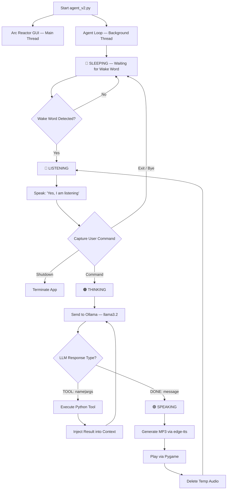

<div align="center">


<br/><br/>

```
   ██╗ █████╗ ██████╗ ██╗   ██╗██╗███████╗
   ██║██╔══██╗██╔══██╗██║   ██║██║██╔════╝
   ██║███████║██████╔╝██║   ██║██║███████╗
██ ██║██╔══██║██╔══██╗╚██╗ ██╔╝██║╚════██║
╚█████╔╝██║  ██║██║  ██║ ╚████╔╝ ██║███████║
 ╚════╝ ╚═╝  ╚═╝╚═╝  ╚═╝  ╚═══╝  ╚═╝╚══════╝
```

# Jarvis — Local Voice AI Assistant

**Fully offline. Iron Man-style. Runs entirely on your machine.**

*Local LLM · ReAct Tool Loop · Wake Word Detection · Neural TTS · Arc Reactor GUI*

<br/>

</div>

---

## 🧠 What is Jarvis?

Jarvis is a privacy-first, fully offline voice assistant built on an **agentic ReAct (Reasoning + Acting) loop**. Say *"Hey Jarvis"* — it wakes up, listens to your command, reasons using a local LLM running via Ollama, calls system tools, and responds in a neural voice.

No cloud. No API keys. No internet required. Everything runs on your machine.

---

## ✨ Features

| Feature | Details |
|--------|---------|
| 🎙️ **Wake Word** | "Hey Jarvis" / "Jarvis" — fully offline via openWakeWord |
| 🧠 **Local LLM** | Ollama running `llama3.2` — no cloud, no API keys |
| 🔁 **ReAct Tool Loop** | LLM reasons → calls tools → feeds result back → final answer |
| 🎨 **Arc Reactor GUI** | Tkinter UI that changes color based on Jarvis's state |
| 🔊 **Neural TTS** | Microsoft Edge neural voice (`en-AU-WilliamNeural`) via `edge-tts` |
| 🧵 **Multi-threaded** | GUI on main thread, agent loop on background thread |

---

## 🎨 Arc Reactor States

```
  🔵 SLEEPING   →  Waiting for wake word
  🩵 LISTENING  →  Actively capturing your command  
  🟠 THINKING   →  LLM reasoning / tool execution
  🟢 SPEAKING   →  Generating and playing audio response
```

---

## 🛠️ Available Tools

| Tool | Description |
|------|-------------|
| `open_app` | Launch desktop apps (Notepad, Chrome, Spotify, etc.) |
| `close_app` | Close running desktop apps |
| `search_web` | Open web queries in your default browser |
| `get_system_stats` | CPU %, RAM usage, Disk storage |
| `get_weather` | Weather via IPWhois geolocation or manual city |
| `take_screenshot` | Captures and saves to `Documents/jarvis/photo` |
| `start_recording` | Screen recording saved to `Documents/jarvis/video` |
| `stop_recording` | Stops active screen recording |
| `write_file` | Create and write content to a text file |
| `read_file` | Read contents of an existing file |

---

## 🔄 Architecture



---

## 📁 Project Structure

```
Jarvis/
├── agent_v2.py          # Main agent — background thread, Ollama calls, tool orchestration
├── agent_v1.py          # Console-only version — keyboard input, no GUI
├── reactor.py           # Tkinter Arc Reactor GUI — state-based color animation
├── wakeword.py          # Wake word listener — Google Speech Recognition
├── config.py            # Paths, model config, voice settings, allowed apps
├── test_voice.py        # Mic + audio playback test
├── test_edge_voices.py  # Browse Microsoft Edge neural voices
├── test_llm.py          # Verify Ollama connection
├── voice_selection.py   # Query offline voices via pyttsx3
└── requirements.txt     # Python dependencies
```

---

## ⚙️ Setup & Installation

### Prerequisites

**1. Install Ollama and pull the model**
```bash
# Install Ollama from https://ollama.com
ollama pull llama3.2
ollama serve
```

**2. Clone the repository**
```bash
git clone https://github.com/vigneshwaran484/Jarvis.git
cd Jarvis
```

**3. Install Python dependencies**
```bash
pip install -r requirements.txt
```

---

## 🚀 Running Jarvis

### Full Voice Assistant (V2) — with Arc Reactor GUI
```bash
python agent_v2.py
```
> The Arc Reactor window will open. Say **"Hey Jarvis"** to wake it up.
> Say **"bye"** to put it back to sleep. Say **"quit"** or **"exit"** to shut down.

### Console Assistant (V1) — keyboard input only
```bash
python agent_v1.py
```

---

## 💬 Example Commands

```
"Hey Jarvis"                          →  Wakes up
"What's the weather in Chennai?"      →  Fetches live weather
"Open Spotify"                        →  Launches Spotify
"Take a screenshot"                   →  Saves to Documents/jarvis/photo
"Start recording"                     →  Begins screen recording
"Write a file called notes.txt with my ideas"  →  Creates the file
"What's my CPU usage?"                →  Reports system stats
"Search YouTube for lo-fi music"      →  Opens browser search
"Bye"                                 →  Goes back to sleep
```

---

## 🧪 Testing Utilities

```bash
python test_voice.py         # Test microphone input and audio playback
python test_llm.py           # Verify your Ollama instance is running
python test_edge_voices.py   # Explore available Edge neural voices
python voice_selection.py    # List available offline system voices
```

---

## 🔧 Configuration

Edit `config.py` to customize:

```python
MODEL_NAME = "llama3.2"           # Ollama model to use
VOICE = "en-AU-WilliamNeural"     # Edge TTS voice
ALLOWED_APPS = ["chrome", "notepad", "spotify", ...]  # Whitelisted apps
PHOTO_DIR = ".../Documents/jarvis/photo"
VIDEO_DIR = ".../Documents/jarvis/video"
```

---

## 📦 Dependencies

```
ollama          # Local LLM runtime
openWakeWord    # Offline wake word detection
edge-tts        # Microsoft neural TTS
pygame          # Audio playback
speechrecognition + pyaudio  # Voice input
tkinter         # Arc Reactor GUI (built-in Python)
requests        # Weather + IPWhois geolocation
```

---

## 🗺️ Roadmap

- [ ] Add more tools (calendar, alarms, local file search)
- [ ] Demo video + GIF walkthrough
- [ ] Support for custom wake words via openWakeWord training
- [ ] Swap Google Speech Recognition for a fully offline STT (Whisper)
- [ ] Plugin system for community-built tools

---

## 📄 License

This project is licensed under the **Apache 2.0 License** — see [LICENSE](LICENSE) for details.

> openWakeWord models are licensed under Apache 2.0 / CC BY-NC-SA 4.0.

---

<div align="center">

Built by [Vigneshwaran C](https://github.com/vigneshwaran484) · [Portfolio](https://vigneshwaran-c-portfolio.netlify.app)

*"Sometimes you gotta run before you can walk." — Tony Stark*

</div>